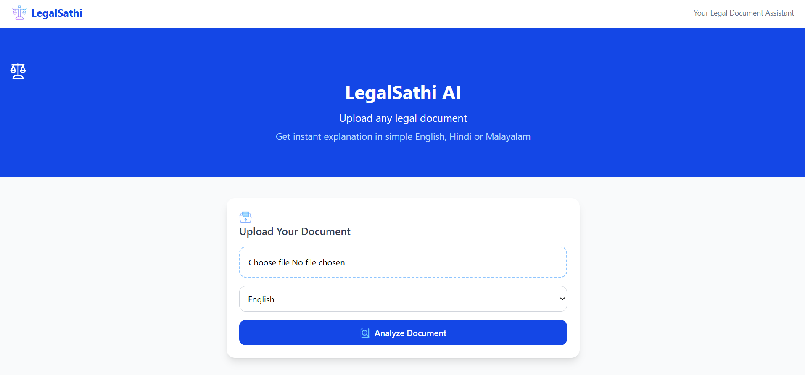
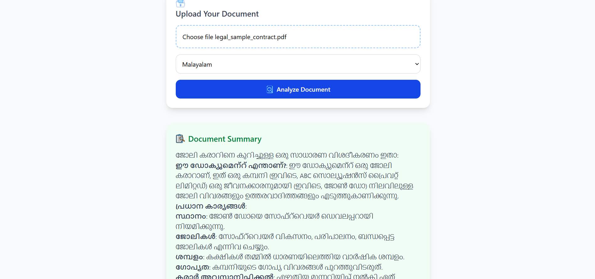

# ⚖️ LegalSathi AI

AI-powered legal document simplifier for common people.

## 🔍 What is LegalSathi?

LegalSathi lets anyone upload a legal document (PDF or image) and instantly understand it in simple English, Hindi, or Malayalam — no lawyer needed!

## 🚀 Features

- 📄 Upload PDF or scanned image documents
- 🤖 AI-powered explanation using Groq (Llama 3)
- 🌐 Supports English, Hindi & Malayalam
- 🔒 Documents are never stored — privacy first
- ⚡ Fast and free to use

## 🛠️ Tech Stack

| Layer | Technology |
|-------|-----------|
| Frontend | React + Vite + Tailwind CSS |
| Backend | Django + Django REST Framework |
| AI | Groq API (Llama 3.3 70B) |
| Languages | English, Hindi, Malayalam |

## ⚙️ Setup Instructions

### Backend
```bash
cd backend
python -m venv venv
venv\Scripts\activate
pip install -r requirements.txt
python manage.py runserver
```

### Frontend
```bash
cd frontend
npm install
npm run dev
```

### Environment Variables
Create a `.env` file in the `backend` folder:

GROQ_API_KEY=your_groq_api_key_here

## 📸 Screenshots


### Home Page


### Result Page


## 👨‍💻 Built by

Adila Jaleel — Full Stack Developer